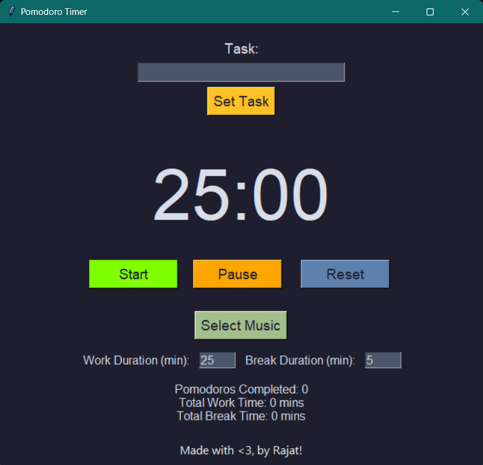

# Pomodoro Timer

## Overview

The Pomodoro Timer is a productivity tool that helps you manage your work sessions and breaks using the Pomodoro Technique. This technique involves breaking your work into 25-minute focused intervals, separated by short breaks. Our Pomodoro Timer provides an intuitive and aesthetically pleasing GUI, along with features like task setting, music during breaks, and automatic transitions between work and break periods.

## Features

- **High-Resolution GUI**: A visually appealing and user-friendly interface.
- **Task Management**: Enter and fix tasks for focused work sessions.
- **Automated Breaks**: Automatically transitions between work and break periods.
- **Music Selection**: Choose and play music during breaks.
- **Voice Notifications**: Voice alerts to notify you when tasks and breaks start and end.
- **Customizable Timing**: Adjustable work and break durations.

## Screenshots



## Installation

1. **Clone the repository:**
   ```bash
   git clone https://github.com/your-username/pomodoro-timer.git
   cd pomodoro-timer
   ```

2. **Install dependencies:**
   ```bash
   pip install pygame pyttsx3
   ```

3. **Run the application:**
   ```bash
   python pomodoro.py
   ```

## Usage

1. **Set a Task**: Enter your task in the provided entry field and click "Set Task".
2. **Start Timer**: Click the "Start" button to begin the 25-minute work session.
3. **Take Breaks**: The timer will notify you when the session ends and automatically start the break period.
4. **Select Music**: Click "Select Music" to choose a music file to play during breaks.
5. **Stop/Reset Timer**: Use the "Stop" and "Reset" buttons to control the timer.

## Contributing

We welcome contributions! Here’s how you can help:

1. Fork the repository.
2. Create a new branch: `git checkout -b feature-branch`.
3. Make your changes and commit them: `git commit -m 'Add some feature'`.
4. Push to the branch: `git push origin feature-branch`.
5. Submit a pull request.


## Acknowledgements

- The Pomodoro Technique, created by Francesco Cirillo, for inspiring this project.
- The [Nord](https://www.nordtheme.com/) color palette for the aesthetic color scheme.

## Contact

If you have any questions or suggestions, feel free to open an issue or contact me at rajatsoni1345@gmail.com.
